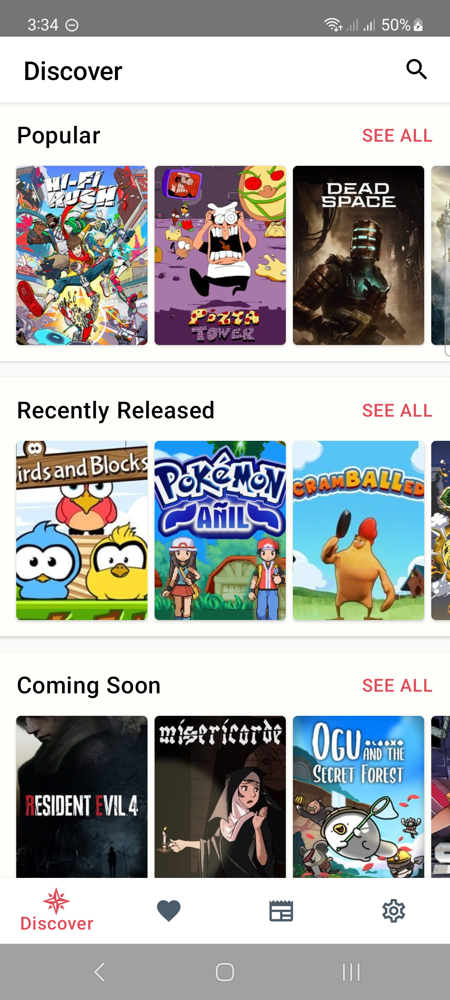
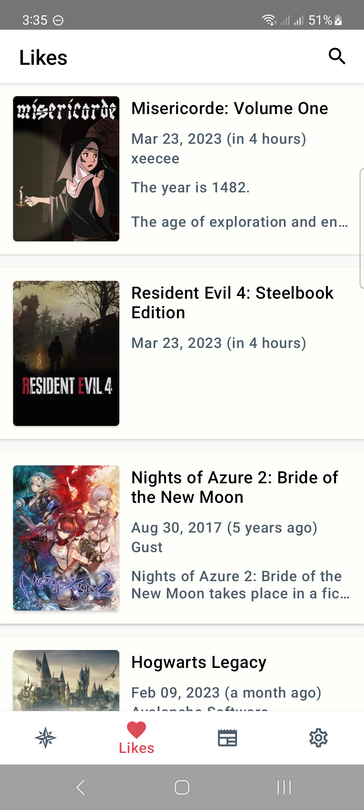
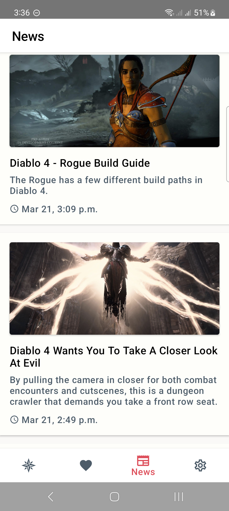
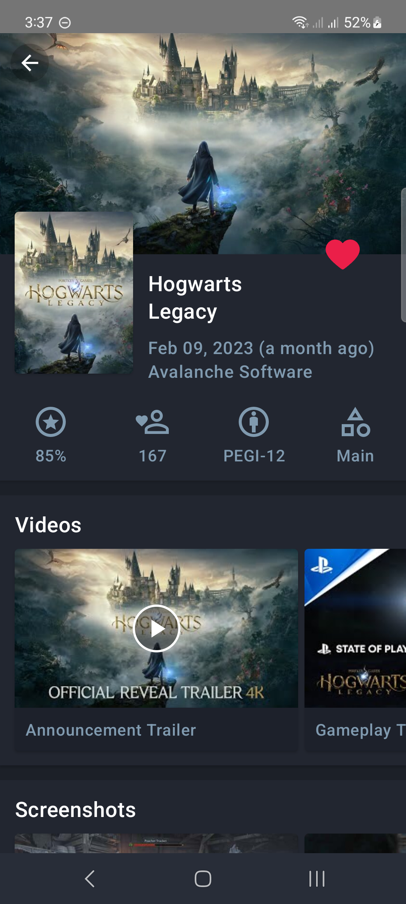
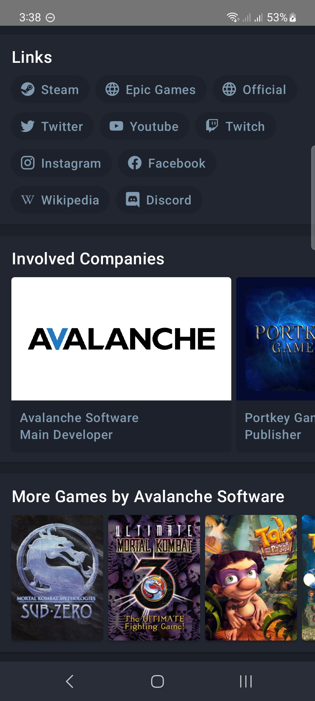

# `Game Hub` React Native App

This is a React Native app for getting all the latest news and information about
video games; it currently uses <a href="https://www.igdb.com/">IGDB</a>
and <a href="https://dev.twitch.tv/">Twitch</a> APIs.

The trello board I use for keeping track of all the tickets of this project is shared in here:
https://trello.com/b/lG03zl6P/game-news-app

## Contents

* [Demonstration](#demonstration)
    * [Videos](#videos)
    * [Screenshots](#screenshots)
* [Tech Stack](#tech-stack)
* [Contribution Guidelines](#contribution-guidelines)
* [Contributors](#Contributors)

## Demonstration

### Videos

<b>Demo 1</b>

https://user-images.githubusercontent.com/8706521/227368120-95590cee-d832-4426-a7e1-4b3fa4e10c3a.mp4

<b>Demo 2</b>

https://user-images.githubusercontent.com/8706521/227369894-81f89cab-8d60-428d-9583-5370024957fd.mp4

### Screenshots

## Tech Stack

- [TypeScript](https://www.typescriptlang.org/) - Superset of JavaScript programming language with syntax for types.
- [JSX](https://react.dev/learn/writing-markup-with-jsx) - A syntax extension for JavaScript that allows for HTML-like
  markup to be written inside a JavaScript/TypeScript file.
- [React Navigation](https://reactnavigation.org/) - A routing and navigation module for React Native apps.
- [Axios](https://axios-http.com/docs/intro) - A promise-based HTTP client for JavaScript.

## Contribution Guidelines

This repo is currently in the process of being fully migrated from a Native
Android app to a multiplatform React Native
project. Following the migration, the corresponding code of conduct for each module will be
provided. 

For the time-being, I am mostly in need of developers who can help me with
migrating the app to React Native. Please hit
me
up with an email if you are interested in cooperating in this project. I plan to sell ads and subscriptions on this app
in the future, so hopefully, your efforts will be paid accordingly. 

## Contributors

Main developer: [Hojat Ghasemi](mailto:hojat72elect@gmail.com)
 
App icon designer: [Grace Peterson](mailto:gracepeterson2@outlook.com)

